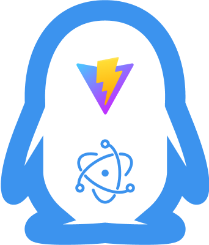
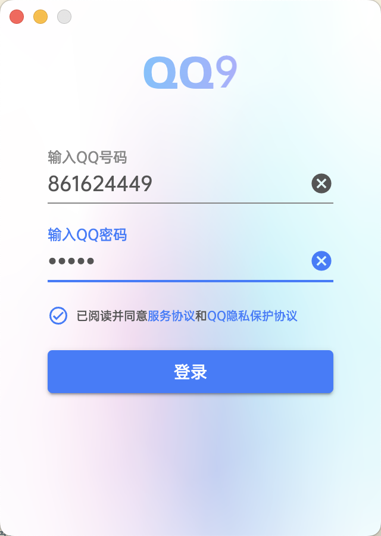
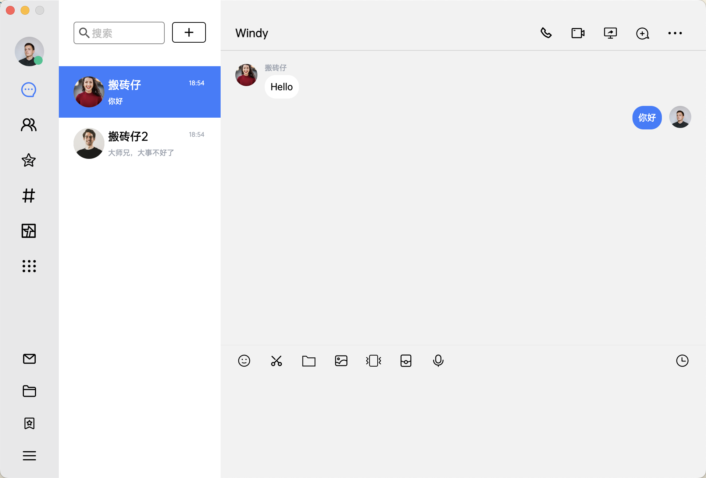
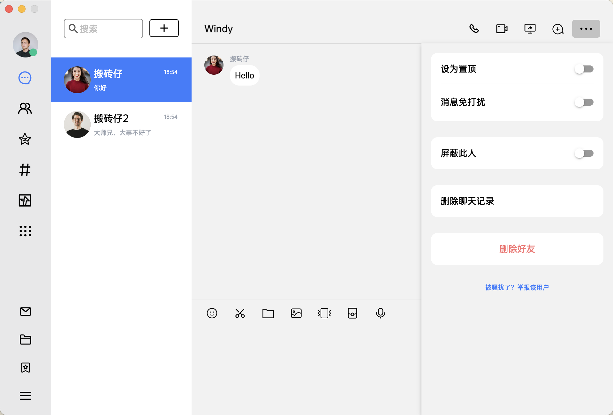

<p align="center">
  <a href="https://github.com/estoi/electron-qq" target="_blank">
    
  </a>
</p>

<p align="center">
  <a href="https://github.com/vuejs/vue">
    
  </a>
  <a href="https://cn.vitejs.dev/">
    
  </a>
  <a href="https://www.electronjs.org/zh/">
    
  </a>
   <a href="https://pinia.vuejs.org/">
    
   </a>
   <a href="https://varlet.gitee.io/varlet-ui/#/zh-CN/index">
    
   </a>
   <a href="https://unocss.dev/">
    
   </a>
   <a href="https://www.typescriptlang.org/">
    
   </a>
   <a href="https://bun.sh/">
    
   </a>
   
</p>

> 一个基于`Electron+Vite+Vue3`开发的QQ9的高仿版客户端

## 简介

QQ9的高仿版, 欢迎Star

项目目的:

- 学习vue3+ts
- 学习electron
- 学习unocss
- 等等...

## 功能

```text
- 登录
- 聊天(开发中)
- 其他待开发
```

## 截图






## 目录结构

```
├─ .eslintrc.json     # eslint
├─ .prettierrc.cjs    # prettier
├─ README.md
├─ dist               # 打包dist
├─ mock               # mock服务
├─ public             # 静态资源
├─ types              # ts 声明
├─ src                # 源码
│  ├─ assets          # 静态资源
│  ├─ components      # 公共组件
│  ├─ layout          # 全局Layout
│  ├─ router          # 路由
│  ├─ store           # 全局store管理
│  ├─ utils           # 全局公共方法
│  └─ views           # 所有业务页面
├─ bunfig.toml        # bun 下载源
├─ tsconfig.json      # ts 编译配置
├─ unocss.config.ts   # unocss 配置
└─ vite.config.ts     # vite 配置
```

## 启动项目

```bash
bun run dev
```

## License

[MIT](https://github.com/estoi/electron-qq/blob/master/LICENSE)

Copyright (c) 2024-present 
